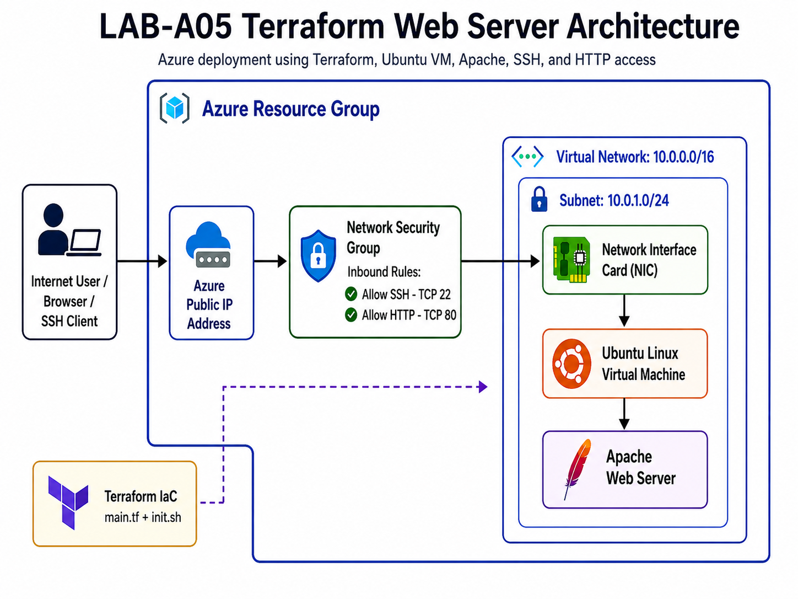
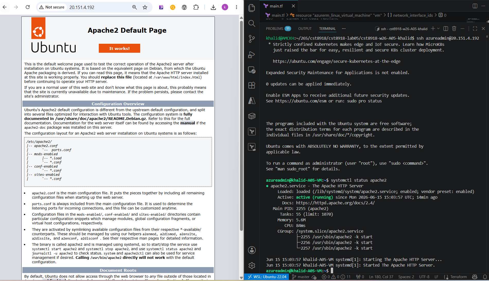

# LAB-A05: Terraform Web Server
## Student Information

**Name:** Khalid Amchat  

**Student ID**: 041125350

**Semester**: Spring 2026

**Course:** CST8918-DevOps: Infrastructure as Code  

## Overview

This lab demonstrates how to use **Terraform** to deploy a simple web server on **Microsoft Azure**. The solution creates a Linux virtual machine running Ubuntu and installs Apache using a cloud-init script. The web server is publicly accessible through HTTP, and the virtual machine can also be accessed using SSH.

The goal of this lab is to manage basic Azure infrastructure using Infrastructure as Code instead of creating the resources manually in the Azure portal.

---

## Scenario

A small professional services company wants to move an existing on-premises web server to Azure. As the DevOps engineer, I used Terraform to create the first version of the cloud infrastructure. This version deploys one Ubuntu virtual machine with Apache installed and allows public access through SSH and HTTP.

---

## Architecture

The solution includes the following Azure resources:

- Resource Group
- Public IP Address
- Virtual Network
- Subnet
- Network Security Group
- Network Interface Card
- Ubuntu Linux Virtual Machine
- Apache Web Server installed using cloud-init

The architecture diagram is included in this repository as:

```text
a05-architecture.png
```



---

## Project Structure

```text
.
├── .gitignore
├── main.tf
├── init.sh
├── a05-architecture.png
└── a05-demo.png
```

---

## Terraform Configuration Summary

The Terraform configuration uses the following providers:

- `azurerm` for creating and managing Azure resources
- `cloudinit` for running the Apache installation script when the virtual machine starts

The main resources created are:

| Resource | Purpose |
|---|---|
| Resource Group | Groups all lab resources together |
| Public IP | Provides public access to the VM |
| Virtual Network | Provides network isolation |
| Subnet | Hosts the VM network interface |
| Network Security Group | Allows SSH and HTTP inbound traffic |
| Network Interface | Connects the VM to the subnet and public IP |
| Linux Virtual Machine | Runs Ubuntu and Apache |
| Cloud-init Script | Installs Apache automatically |

---

## Security Rules

The Network Security Group allows the following inbound traffic:

| Port | Protocol | Purpose |
|---|---|---|
| 22 | TCP | SSH access to the VM |
| 80 | TCP | HTTP access to the Apache web server |

---

## VM Size Note

The lab originally suggested using the `Standard_B1s` VM size. During deployment, Azure returned an error because `Standard_B1s` was not available in the `Canada Central` region.

To complete the deployment, I changed the VM size to:

```text
Standard_B2ats_v2
```

This VM size is still a small burstable VM and is suitable for this lab because the workload only requires a basic Apache web server.

---

## Deployment Steps

### 1. Login to Azure

```bash
az login
```

### 2. Initialize Terraform

```bash
terraform init
```

### 3. Validate the Terraform configuration

```bash
terraform validate
```

### 4. Format the Terraform files

```bash
terraform fmt
```

### 5. Deploy the infrastructure

```bash
terraform apply
```

When prompted for `labelPrefix`, I entered my username.

---

## Output Values

After deployment, Terraform displayed the following output values:

- Resource group name
- Public IP address

These outputs were used to verify the deployment in the Azure portal, in the browser, and through SSH.

---

## Verification

### Azure Portal Verification

I verified that the resource group was created successfully and contained the required resources, including the virtual machine, public IP address, virtual network, subnet, network security group, and network interface.

### Browser Verification

I copied the public IP address from the Terraform output and opened it in a browser using:

```text
http://<public-ip-address>
```

The Apache default web page was displayed successfully.

### SSH Verification

I connected to the virtual machine using SSH:

```bash
ssh azureadmin@<public-ip-address>
```

After connecting to the VM, I checked that Apache was running.

---

## Demo Screenshot

The deployment screenshot is included in this repository as:

```text
a05-demo.png
```



---


## Clean Up

After completing the lab and taking the required screenshots, the Azure resources can be removed using:

```bash
terraform destroy
```

This deletes the Azure resources and avoids unnecessary charges.

---

## Conclusion

This lab showed how Terraform can be used to automate the deployment of a basic Azure web server. The infrastructure was defined in code, version controlled with Git, deployed to Azure, and verified using the Azure portal, browser access, and SSH access.
